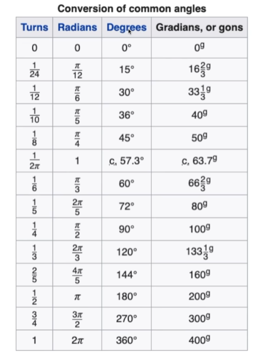

# **Belajar CSS**
## Daftar Isi
- [🤹🏼 CSS VALUE & UNIT](##CSS-VALUE-&-UNIT)
  - [Nilai & Satuan pada CSS](####Nilai-&-Satuan-pada-CSS)
    - [CSS value](###CSS-value)
      - [integer / Bilangan Bulat](####integer-/-Bilangan-Bulat)
      - [number / Bilangan Pecahan](####number-/-Bilangan-Pecahan)
      - [precentage](####percentage)
      - [dimension](###dimension)
        - [Length](####Length)
          - [Absolute](###Absolute)
          - [Relative](###Relative)
      - [Angle](####Angle)
        - [deg](#deg)
        - [rad](#rad)
        - [grad](#grad)
        - [turn](#turn)
      - [time](####time)
        - [s / second](#s)
        - [ms / miliseconds](#ms)
      - [resolution](####resolution)
        - [dpi / dot per inch](#dpi)
        - [dpcm / dot per centimeter](#dpcm)
        - [dppx / dot per pixel](#dppx)
## ***CSS VALUE & UNIT***
#### **Nilai & Satuan pada CSS**

Contoh :
```css
.selector {
  width: 80%; // 80 disebut value
  height: 500px; // px disebut unit
  font-size: 2em;
  opacity: 0.5;
  transform: rotate(30deg);
  box-shadow: 0 0 10px rgba(0,0,0,.7);
  position: absolute;
  z-index: -9999;
}
```
### CSS value
* #### **integer** / Bilangan Bulat

**Contoh**
```css
.selector {
  z-index: 1;
  z-index: -9999;
  order: 3;
  grid-column-start: 2;
  grid-row-end: -4
}
```
* #### **number** / Bilangan pecahan

**Contoh**
```css
.selector {
  opacity: 0.8;
  transform: scale(2.5);
}
```
* #### **percentage**  
  "% Merepresentasika sebagian dari nilai tertentu % selalu relative terhadap nilai yang lain"

**Contoh**
```css
.box-besar {
  width: 80%;
  height: 200px;
  background-color: salmon;
}
```
```css
.box-besa .box-kecil {
  width: 50%;
  height: 100px;
  background-color: royalblue;
}
```
* ### **dimension**
    Number yang memiliki satuan di belakangnya
  * #### **Length** 
    * ### **Absolute**

      ### **Length Abolute**

      |***Absolute Unit*** | ***Description*** | ***Example***| 
      |:-----:|:-----:|:-----:|
      |px| 1/96 of 1 inch (96px = inch)|font-size: 12px;|
      |pt| 1/78 of 1 inch (72pt = 1 inch)| font-size: 12pt;|
      |pc| 12pt = 1pc| css font-size:1.2pc;|
      |cm| centimeter|font-size: 4mm;|
      |mm| millimeter(10 mm = 1 cm)| font-size: 4mm;|
      |in| inches|font-size:0.2in;|

    * ### **Relative**
      ### **Length - Relative**

      |***Relative unit*** | ***Keterangan*** |
      :-----:|:-----:|
      |% | presentasi ukuran relatif terhadap ukuran elment parent|
      |em| relatif terhadap ukuran font yang sedang digunakan |
      |rem| relatif terhadap ukuran font "root" / <html>|
      |ch| relatife terhadap lebar karakter '0' dari font yang sedang digunakan |
      |vh| relatif terhadap tinggi dari viewport|
      |vw| relatif terhadap lebar dari viewport|
      |vmin| relative terhadap dimensi terkecil sebuah viewport|
      |vmax| relative terhadap dimensi terbesar sebuah viewport|

      ### **Contoh**
      #### **em** - ***relative terhadap ukuran font yang sedang digunakan*** 
      ```html
      <div class="box">
        <h1>Hello World</h1>
        <p>Belajar CSS Bersama<p>
      </div> 
      ```
      ```css 
      .box {
        font-size: 30px;
      }

      .box h1 {
        font-size: 1em;
      }

      .box p {
        font-size: 2em;
      }
      ```
      #### **rem** - ***relative terhadap ukuran font "root" / html*** 
      ```html
      <div class="box">
        <h1>Hello World</h1>
        <p>Belajar CSS Bersama<p>
      </div> 
      ```
      ```css 
      .html {
        font-size: 50px;
      }

      .box {
        font-size: 30px;
      }

      .box h1 {
        font-size: 1rem;
      }

      .box p {
        font-size: 2rem;
      }
      ```
      #### **ch** - ***relative terhadap lebar karakter '0' dari font yang sedang digunakan*** 
      ```html
      <div class="box">
        <p>Lorem ipsum dolor sit amet, consectetur adipiscing elit. Ullamillum temporibus eos neque error reiciendis
        </p>
      </div>
      ```
      ```css
      .box {
        width: 60ch; // 60 karakter
      }
      ```
      #### **vh (viewport height) & vw (viewport width)** - ***.***
      ```css
      .box {
        background-color: lightblue;
        height: 100vh;
      }
      ```
      #### **vmin** - ***adalah ukuran layar paling kecil***
      ```css
      .box {
        background-color:lightblue;
        height: 100vmin;
        width: 100vmin;
      }
      ```
      #### **vmax** - ***akan mengambil viewport terpanjangnya atau tinggi maksimalnya***
      ```css
      .box {
        background-color:lightblue;
        height: 100vmax;
        width: 100vmax;
      }
      ```

  * #### **Angle**
    * **deg**
     / degree / derajat
    * **rad**
     / radian
    * **grad**
     / gradian
    * **turn** 
     / untuk menentukan berapa putaran
     
    **RUMUS** 

     

    **Hasil CSS**
    ```css
      .box {
      width: 10px;
      height: 100px;
      margin: 50px;
      background-color: salmon;

      transform: rotate(30deg);
      /* 1 / 12 */
      transform: rotate(0.08333333turn);
      /* n / 6 */
      transform: rotate(0.53333333rad);
      /* 33 1/3 */
      transform: rotate(33.3grad);
    }
    ```
  * #### **time** 
    * **s** / second / detik
    * **ms** / miliseconds / milidetik

      **Contoh** 
      ```css
      .box {
        transition: 300ms; // => 0.3s
      }
       ```

  * #### **resolution** / Untuk menentukan resolusi dari tampilan website
    * #### **dpi** / dot per inch
    * #### **dpcm** / dot per centimeter
    * #### **dppx** / dot per pixel

    **Contoh**
    ```css
    @media print and (min-resolution: 300dpi) {

    }
    ```


#### ***Resources CSS Value & Unit :***
- https://developer.mozilla.org/en-US/d...​
- https://www.w3.org/Style/Examples/007...​
- https://alligator.io/css/css-units-ex...​
- https://css-tricks.com/fun-viewport-u...
