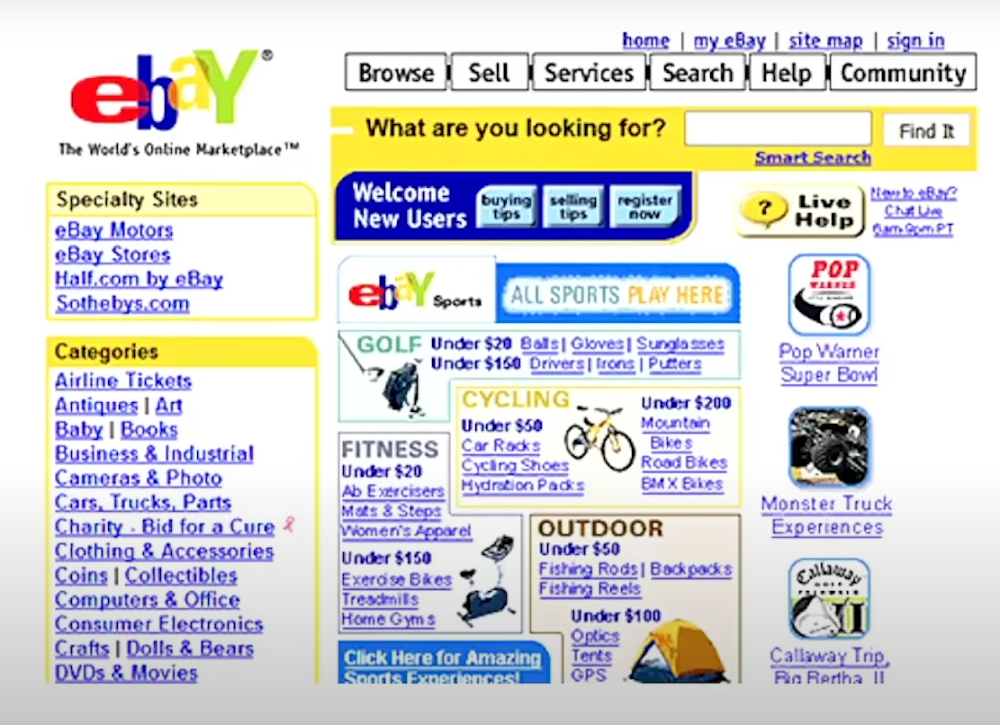

[<< Kembali](../README.md)

# **5 PROPERTI CSS KEREN**

## PRE-REQUISITE

- HTML
- CSS Dasar
- CSS Layouting
- CSS 3

## REQUIREMENT

- VSCode
- Google Chrome
- Live Server Extension

## **CSS (Cascading Style Sheet)**

### Tiga Componen dasar


- **HTML :** digunakan untuk membuat struktur atau kerangka
- **CSS :** digunakan untuk menghias atau membuat baju buat website kita
- **JavaScript :** Membuat website kita lebih pintar


## **Diagram CSS / module" dalam CSS**

Module dalam CSS di atur oleh [w3.org](https://www.w3.org/Style/CSS/Overview.en.html)


- Warna Hijau => sudah di suport hampir semua browser
- Warna Hijau tua => belum semua di suport browser
- Warna Merah => Fitur experiential

## **Website Pertama di Dunia**

### **Sejarah Website pertama**

- [History Stories](https://www.history.com/news/the-worlds-first-web-site#:~:text=On%20August%206%2C%201991%2C%20without,particle%20physics%20lab%20in%20Switzerland.)

- [CERN](http://info.cern.ch/) in the 1980s

### **Web Design in the 90s - 20s**


**Trend Website pada zaman dahulu**


- **Website Microsoft**


- **Website Ebay**



- Trend Website jaman dulu adalah membuat sudutnya yang tumpul
- Jaman sekarang membuat sudutnya tupul mengunakan BORDER-RADIUS
- Kalau Zaman dulu membuat sudut tumpul mengunakan Photoshop

## **5 PROPERTI CSS KEREN**

**1.Clipping Path**

- untuk menyembunyikan bagian dari element dari sebuah jalur

CONTOH

```css
img {
  clip-path: inset(100px 0 0 0);
  /* atas kana bawah kiri */
  clip-path: inset(100px 0 0 0); */
  clip-path: circle(50px)
  clip-path: ellipse(200px 200px)
  border-radius: 50%;
  clip-path:polygon(0 0, 150px 150px, 330px 300px, 0 600px); /*0 0 titik pertama ada di ujung kiri atas*/
  clip-path: polygon(0 0, 100% 0, 50% 100%);
  clip-path: polygon(5% 15%, 100% 0%, 100% 75%, 75% 75%, 75% 100%, 50% 75%, 0% 75%);
}
```

**Online Clip Path Editor**

- https://bennettfeely.com/clippy/

**1b.Clipping Text**

CONTOH

```CSS
    h1 {
      font-family: Impact, Haettenschweiler, 'Arial Narrow Bold', sans-serif;
      font-size: 60px;
      text-align: center;
      color:black;
      background-image: url(img/desktop.jpg);
      background-attachment: fixed;
      -webkit-text-fill-color: transparent ;
      -webkit-background-clip: text;
    }
```


**2.Masking Image**

CONTOH

```CSS
    img {
      /* mask: url(img/tree.svg);
      -webkit-mask: url(img/tikes.svg);
      mask-repeat: no-repeat;
      -webkit-mask-repeat: no-repeat; */
      mask-border: url(img/tree7.svg);
     -webkit-mask-box-image: url(img/tree7.svg) 30 repeat;
    }
```

**3.Shaping**

- shape-inside | shape-outside

CONTOH

```CSS
    img {
      clip-path: polygon(20% 0%, 0% 20%, 30% 50%, 0% 80%, 20% 100%, 50% 70%, 80% 100%, 100% 80%, 70% 50%, 100% 20%, 80% 0%, 50% 30%);
      float: left;
      shape-outside: polygon(20% 0%, 0% 20%, 30% 50%, 0% 80%, 20% 100%, 50% 70%, 80% 100%, 100% 80%, 70% 50%, 100% 20%, 80% 0%, 50% 30%);
      margin-right: 10px;
    }
```

**4.Text Stroke**

- text-stroke
- box-shadow => bayanganya bisa di tumpuk

CONTOH

```CSS
    h1 {
      font-family: Impact, Haettenschweiler, 'Arial Narrow Bold', sans-serif;
      font-size: 60px;
      text-align: 60px;
      /* text-shadow: 0 0 10px blue; */
      text-stroke: 10px blue;
      -webkit-text-stroke: 4px blue;
    }
```

**4.Blending Modes**

- background-blend-mode | mix-blend-mode

CONTOH
```CSS
    .box {
      width: 600px;
      height: 350px;
      background-image: url(img/ds.jpg);

    }

    .box h1 {
      font-family: Impact, Haettenschweiler, 'Arial Narrow Bold', sans-serif;
      font-size: 40px;
      text-align: center;
      line-height: 350px;
      /* mix-blend-mode: multiply; */
      mix-blend-mode: screen;
      color: green;
    }
```
- **Fungsi dari beberapa MODUL**

    |Blending Mode| |
    |-------------|-|
    | 🅞 color| 🅞 lighten|
    | 🅞 color-burn| 🅞 luminosity|
    | 🅞 color-dodge| 🅞 multiply|
    | 🅞 darken| 🅞 normal|
    | 🅞 difference| 🅞 overlay|
    | 🅞 exclusion| 🅞 saturation|
    | 🅞 hard-light| 🅞 screen|
    | 🅞 hue| 🅞 soft-light|


#### Resource Link
- https://test2.wikipedia.org/wiki/Cascading_Style_Sheets
- https://css-tricks.com/clipping-masking-css/
- https://css-tricks.com/working-with-shapes-in-web-design/
- https://www.w3.org/Style/CSS20/history.html
- https://freesvg.org/
- https://css-tricks.com/almanac/properties/t/text-stroke
- https://alligator.io/css/exploring-blend-modes/
- https://getflywheel.com/layout/css-blend-modes
- https://www.youtube.com/watch?v=dYoQyjpKk18
